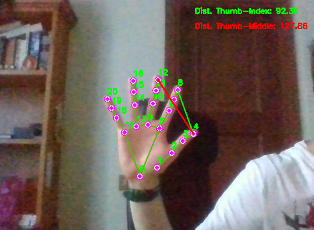

# Gesture-Controlled Media Player

Control your media playback with hand gestures! This project uses computer vision and hand gesture recognition to play/pause media on your computer, all without touching your keyboard.


## Features

- Real-time hand tracking using MediaPipe
- Gesture recognition for play/pause functionality
- Visual feedback with landmark and connection drawing
- Distance calculation between fingertips
- Smooth toggling with a cooldown period to prevent accidental triggers
- Works with most media players that use spacebar for play/pause

## How It Works

1. The webcam captures video input
2. MediaPipe detects and tracks hand landmarks
3. The script calculates distances between specific fingertips
4. When the correct gesture is detected, it simulates a spacebar press
5. A cooldown period prevents rapid, unintended toggles

Here's a visual representation of the hand landmarks:



## Requirements

- Python 3.7+
- OpenCV (`cv2`)
- MediaPipe
- PyAutoGUI
- A webcam

## Installation

1. Clone this repository:
   ```
   git clone https://github.com/yourusername/gesture-controlled-media-player.git
   cd gesture-controlled-media-player
   ```

2. Install the required packages:
   ```
   pip install opencv-python mediapipe pyautogui
   ```

## Usage

1. Run the script:
   ```
   python gesture_control.py
   ```

2. Position your hand in front of the webcam.

3. To play/pause media:
   - Bring your thumb and index finger close together (distance <= 20 pixels)
   - Keep your middle finger extended away from your thumb (distance >= 80 pixels)

4. The script will simulate pressing the spacebar, which typically toggles play/pause in most media players.

5. To exit the program, press 'q' while the webcam window is active.


## Customization

You can adjust the following parameters in the script to fine-tune the gesture recognition:

- `min_detection_confidence` and `min_tracking_confidence` in the `mp_hands.Hands()` call
- The distance thresholds for finger tip proximity
- The `toggle_interval` to adjust the cooldown period between gestures

Example:

```python
# Adjust these values in the script
min_detection_confidence = 0.8
min_tracking_confidence = 0.5
thumb_index_threshold = 20
thumb_middle_threshold = 80
toggle_interval = 1.0
```

## Troubleshooting

If you encounter issues:

1. Ensure your webcam is properly connected and recognized by your system.
2. Check that you have sufficient lighting for hand detection.
3. Try adjusting the `min_detection_confidence` and `min_tracking_confidence` values.
4. Make sure no other application is using your webcam.

## Future Enhancements

- Support for multiple gestures to control volume, skip tracks, etc.
- GUI for easy customization of gesture thresholds
- Integration with specific media players for enhanced control

## Contributing

Contributions, issues, and feature requests are welcome! Feel free to check [issues page](https://github.com/yourusername/gesture-controlled-media-player/issues).

1. Fork the Project
2. Create your Feature Branch (`git checkout -b feature/AmazingFeature`)
3. Commit your Changes (`git commit -m 'Add some AmazingFeature'`)
4. Push to the Branch (`git push origin feature/AmazingFeature`)
5. Open a Pull Request

## License

Distributed under the MIT License. See `LICENSE` for more information.

## Acknowledgements

- [MediaPipe](https://mediapipe.dev/)
- [OpenCV](https://opencv.org/)
- [PyAutoGUI](https://pyautogui.readthedocs.io/)

